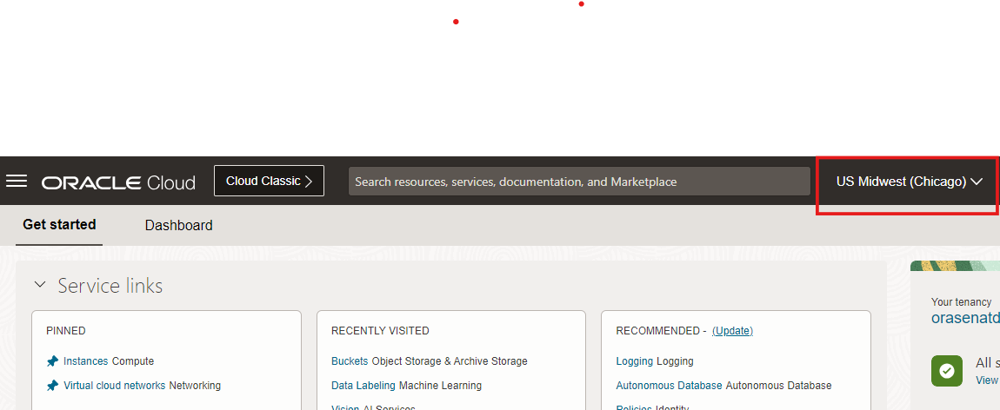
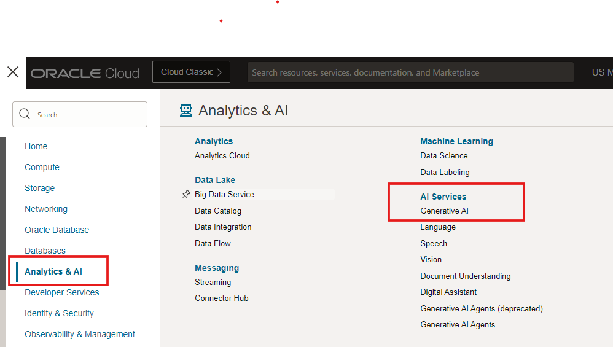
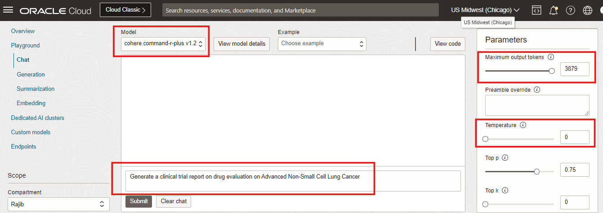
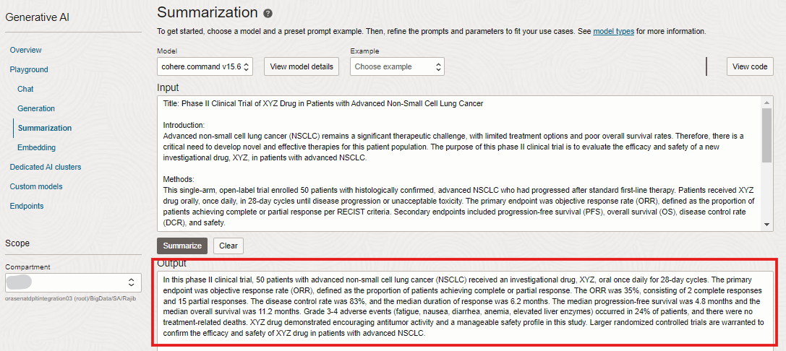
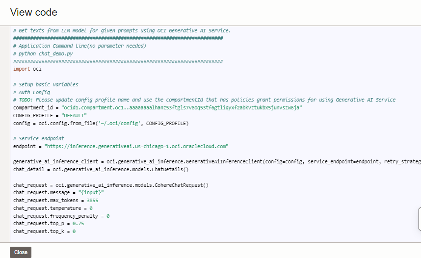

# OCI Generative AI Playground and Trial Generation

## Introduction

Generative AI is a fully managed Oracle Cloud Infrastructure service that provides a set of state-of-the-art, customizable large language models (LLMs) that cover a wide range of use cases, including chat, text generation, summarization, and creating text embeddings. Use the Generative AI  playground to try out the ready-to-use pre-trained models. It also supports creating your own fine-tuned custom models based on your own data in a secure dedicated cluster environment

Estimated Lab Time: -- 5 minutes

### OCI Generative AI Playground

OCI Generative AI Playground allows you chat, generate and summarize content and also show numerical vector embeddings for textual data. It is REST API enabled for programmatic access and allows you to tune the outputs of your query based on certain parameters. It currently allows Cohere command R+ and meta Llama model. In this workshop, all the relevant clinical trials data is generated with Cohere command R+ playground.

### Objectives

In this lab, you will:

* Learn how to use OCI Generative AI Playground interactively
* Prompt and generate a few clinical trial documents yourself
* Verify the generated document has no personal information
* Prompt to try out some summarization examples on your text
* View generated API code (Python) and get familiarized

### Prerequisites (Optional)

*List the prerequisites for this lab using the format below. Fill in whatever knowledge, accounts, etc. is necessary to complete the lab. Do NOT list each previous lab as a prerequisite.*

This lab assumes you have:

* An Oracle Cloud account in the Chicago or Frankfurt region
* You have the required policies for OCI Generative AI setup

## Task 1: Accessing OCI Generative AI Playground

In this section you will get familiarity with using OCI Generative AI playground console

1. Login to your Oracle cloud tenancy and change your tenancy to US Midwest (chicago)
 

2. From Hamburger menu (top left corner), pull up Analytics & AI --> AI Services --> Generative AI
 

## Task 2: Generate a clinical trial in OCI Generative AI Playground

1. Click on the Generative AI -> Overview -> Playground -> Chat and Run the example "Generate a job description" with the cohere-command-r-16k model
 

2. Copy the following text in the chat window "Generate a clinical trial report on drug evaluation on Advanced Non-Small Cell Lung Cancer" , change the **Maximum output settings** and the **Temperature** settings. Press Submit button to generate a sample clinical trial for a disease.
 

3. Note that the PII Information is redacted and substituted
 

## Task 3: Generate a summary and view generated code

1. Copy the generated clinical trial to Playground -> Summarization and generate summary.
 

2. Click on the view code button to see the generated code
 

## Learn More

* [OCI Generative AI](https://www.oracle.com/artificial-intelligence/generative-ai/generative-ai-service/)
* [Realize business value by transforming data into action with Generative AI](https://blogs.oracle.com/ai-and-datascience/post/generative-ai-use-cases/)

## Acknowledgements

* **Author** - Rajib Ghosh, Master Principal Cloud Architect, OCI AI and GenAI Center of Excellence
* **Last Updated By/Date** - Aug, 2024
