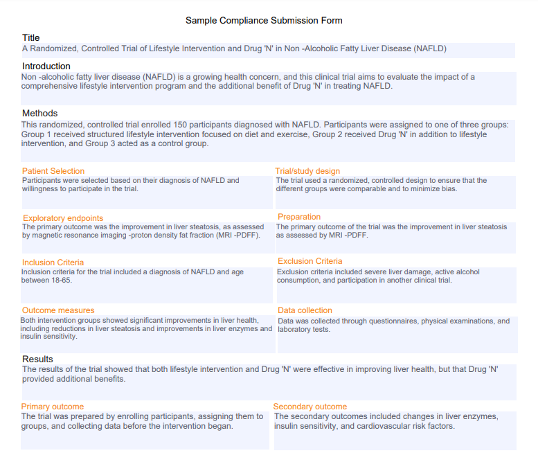

# Generate Compliance submission documents

## Introduction

In this lab, we will generate a sample compliance submission form summarizing the clinical trial data sections from a sample with a pre-canned PDF template. Prompting techniques and formatting has been used to hint the OCI Generative AI large language model to contain sectional summaries in a condensed manner. The process can be extended to summarize across multiple retrieval chunks of data with langchain and vector search.

Estimated Lab Time: -- 10 minutes

### Langchain output parsers and OCI Generative AI

[LangChain](https://python.langchain.com/v0.2/docs/introduction/) is a Python library that simplifies the development, productionization, and deployment of applications powered by large language models (LLMs). It is a development framework that chains LLMs, agents and retrieval strategies to effectively make up an end-to-end application's cognitive architecture. Chains can be defined declaratively for convenience. Langchain output parsers offer various custom formatting options for sectional prompting to extract summarized textual data into a templated format.

### Objectives

In this lab, you will:

* Load clinical-trial PDF documents and embeddings into an Opensearch index
* Use langchain output parser to produce sectional summaries for a document template
* Generate a sample compliance submission form from OCI Generative AI LLM

### Prerequisites

This lab assumes you have:

* Working knowledge of Python and Notebooks
* Working knowledge of OCI Data science and conda packs
* Some knowledge of langchain framework but not required.

## Task 1: Load clinical-trials documents and metadata

1. Get the following information into a notepad or a script

   * Compartment OCID for *clinical-trials* compartment. (Search on OCI console for compartments, click your compartment and copy the OCID)
   * Opensearch username - The username entered while provisioning Opensearch cluster (i,e *osmaster*)
   * Opensearch password - The password entered while provisioning Opensearch cluster
   * API end point Private IP from OCI Opensearch service console

2. Double click to open up the notebook *demo-generate-document.ipynb* Run each of the cells one by one from top by using *Shift+Enter* or play button at the top

3. Substitute the following definitions in the cell as shown below
 

4. Load all PDF documents using PyPDFDirectory loader to load all documents into a pandas data frame

5. Generate page_content and document metadata embeddings using OCI Generative AI

6. Check Opensearch client connectivity. It should show the *OpenSearch([{'host': 'hostname', 'port': 9200}])* as output

7. Load both text and embeddings data into the *idx-oci-genai-clinical-trials* index

8. Paste the title retrieved from the previous lab *demo-vector-search-ext.ipynb* to query based on page_content embeddings

9. Report file metadata and the score.

## Task 2: Generate Compliance document form

1. Selecting the top retrieved document from the query search above.

2. Run the rest of the cells to generate the compliance form for the trial.

3. View the generated compliance form from */home/datascience/conda/data/outputs* directory
 

This involves

1. Defining a pydantic Object base model class called *TrialInfo* to structure document sections and their description instructions. These are formatted instructions that are passed to the OCI Generative AI LLM at runtime.
2. This *TrialInfo* class is a superset representing sectional headers for all clinical-trial documents.
3. Defining a langchain pydantic output parser object and passing the format instructions.
4. Defining a chat prompt template with specific instructions to use the format instructions
5. Using OCI Generative AI chat llm to perform sectional summarization based on the format instructions.
6. Creating a dictionary based on a pre-built PDF form template
7. Filling the template with a PDF filler to generate a compliance form document

## Task 3: Various other ways to customize this notebook

Ways to customize

1. Using langchain chunking classes to split document, embed and load to an index
2. Perform embedding search on chunked documents index
3. Compare chunked retrievals vs full document retrievals and evaluate scores
4. Use a different template or use multiple clinical-trial templates by disease
5. Use other prompting techniques with different format specifications
6. Use a better PDF form filler.

## Learn More

* [Deploy Langchain applications as OCI Model Deployments](https://blogs.oracle.com/ai-and-datascience/post/deploy-langchain-application-as-model-deployment)
* [OCI AI Quick actions](https://docs.oracle.com/en-us/iaas/data-science/using/ai-quick-actions.htm)

## Acknowledgements

* **Author** - Rajib Ghosh, Master Principal Cloud Architect, OCI AI and Gen AI Center of Excellence
* **Last Updated By/Date** - Aug 2024
