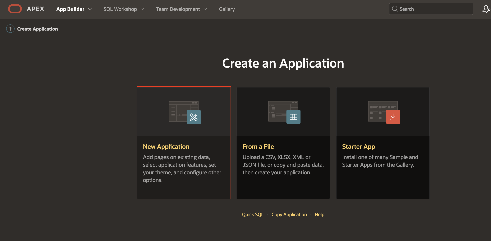
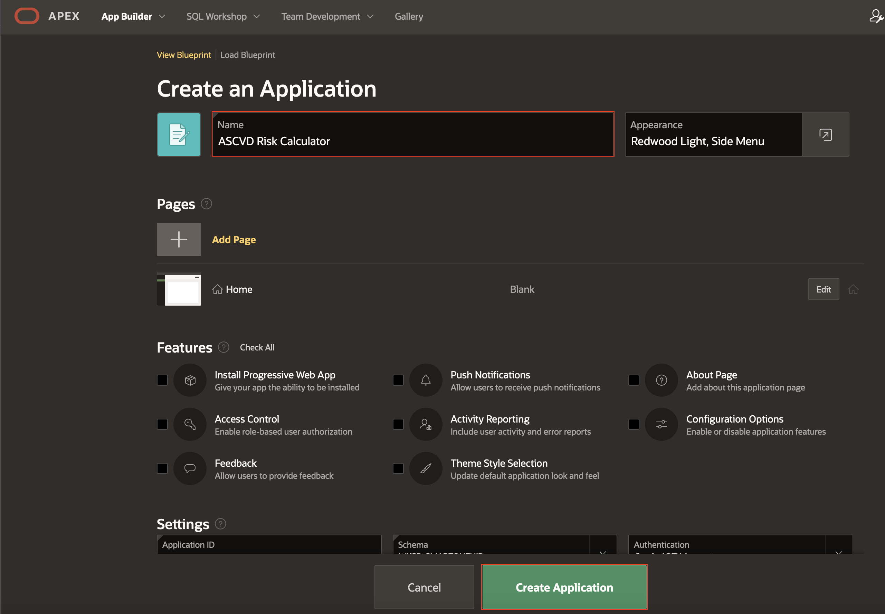
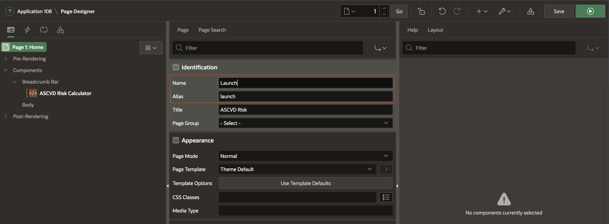
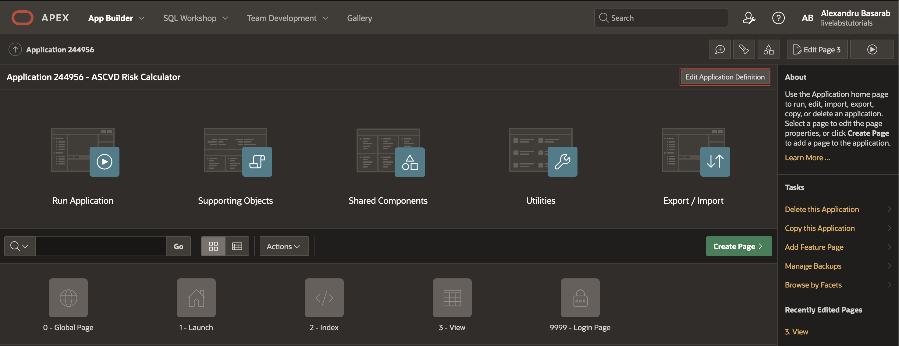
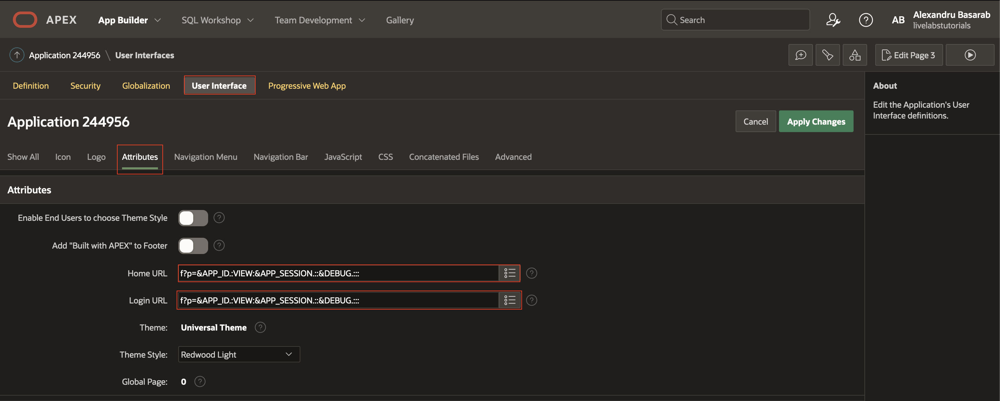

# APEX Application Setup

## Introduction

This lab walks you through creation and initial setup of the Oracle APEX application. You will create a new Oracle APEX application and three pages. Two of the pages (Launch and Index) will handle authentications and authorization in SMART on FHIR and the third one (View) will contain the application objects and logic.

Estimated Time: 10 minutes

### Objectives

In this lab, you will:

* Create a new Oracle APEX application
* Create Oracle APEX pages

### Prerequisites

This lab assumes you have:

* An Oracle Cloud account or free workspace in apex.oracle.com, see previews lab
* All previous labs successfully completed

## Task 1: Create the Application

1. If you have not already logged into your Oracle APEX workspace, sign in using the workspace name, email, and password you signed up with.

   

2. In the App Builder toolbar, click **App Builder**, and click **Create**.

    

3. On the Create Application page, click **New Application**.

    

4. On the Create an Application page, enter **ASCVD Risk Calculator** in the Name field. In the Appearance field, you can change it to **Redwood Light** or leave it as it is and change it later in lab five.  
    *Note: The icon is random each time you create a new application.*

    Click **Create Application** and wait a few seconds for the application to be created.

    

## Task 2: Launch Page

1. Return to the Application Home Page.

   Click **Home**.

   

2. Drag the **Layout** tab to the right panel and the **Page** tab to the middle panel. This placement allows you to always see the attributes of what you are editing in the middle panel.

    *Note: All tabs can be moved, but keep in mind that the workshop uses this layout.*

    

3. Perform the following actions:
      * In the left panel, select the page name (e.g. Page 1: Home).
      * In the Identification section in the middle panel, update the Name value to Launch and Alias value to launch.

    

4. In the Security section in the middle panel, perform the following actions:
    * Update the Authentication value to Page is Public and Page Access Protection value to Unrestricted.
    * Save the page.

    

## Task 3: Use the Create Page Wizard

1. Return to the Application Home Page by clicking the application ID in the upper-left corner.

   Click **Create Page**.

   In the Create a Page dialog, select **Blank Page** and click **Next**.

   

2. In the Create Blank Page dialog, enter Index in the Name field, click the Use Breadcrumb and Use Navigation switches to the off position, and then click **Create Page**.

   

3. In the Security section, update the Authentication value to Page is Public and Page Access Protection value to Unrestricted and then save the page.

    

4. Repeat Steps 1 and 2 to create a new blank page titled **View**.  
   *Note: Don't forget to uncheck Use Breadcrumb and Use Navigation.*

   

5. In the Security section, update the Authentication value to Page is Public and Page Access Protection value to Unrestricted and then save the page.

    

## Task 4: Change application home page

1. Click the application ID to return to the application overview.

    *Note: Your application ID will be different.*

    

2. Click **Edit Application Definition** in the upper-right of the overview page.

    

3. Note the application alias in the Name tab of the Definition section. You will need the application alias later in the workshop to register the app in Code Console.

    

4. In the Attributes tab of the User Interface section, use the URL below to update the Home URL and Login URL values to point to View Page and then click **Apply Changes**.

    **URL:** `f?p=&APP_ID.:VIEW:&APP_SESSION.::&DEBUG.:::`

    

5. Click your account in the upper-right corner, search for **WORKSPACE**, and then note the value in the **WORKSPACE** field. You will need the workspace alias later in the workshop to register the app in Code Console.

    

6. Note or bookmark Oracle APEX Workspace for future reference.

## Acknowledgements

* **Author** - Alexandru Basarab, Software Development Manager, OHAI - Platform Initiatives

* **Contributors**
    * Mircea Iordache, Software Engineer, OHAI - Platform Initiatives
    * Tudor Dragomir, Software Engineer, OHAI - Platform Initiatives
    * Ionut Balan, Software Engineer, OHAI - Platform Initiatives
    * Cornel Porosnicu, Software Engineer, OHAI - Platform Initiatives

* **Last Updated By/Date** - Basarab Alexandru, August 2023
