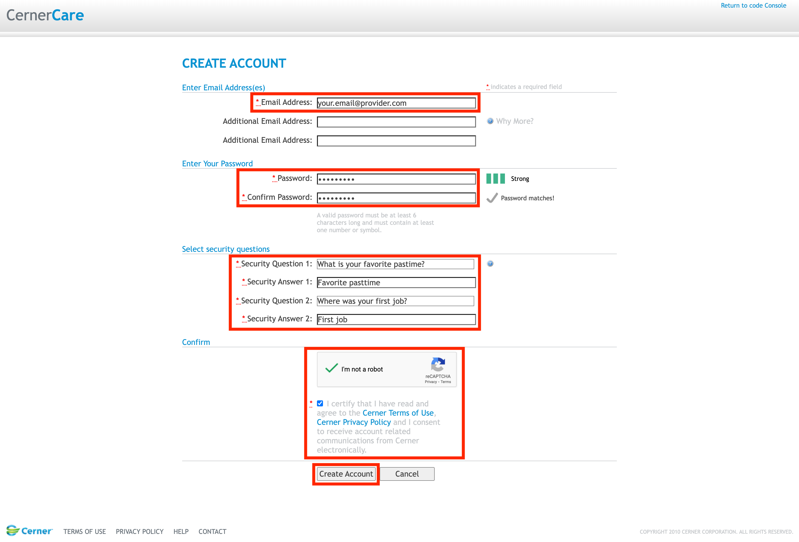
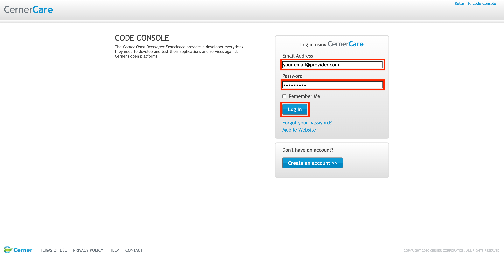
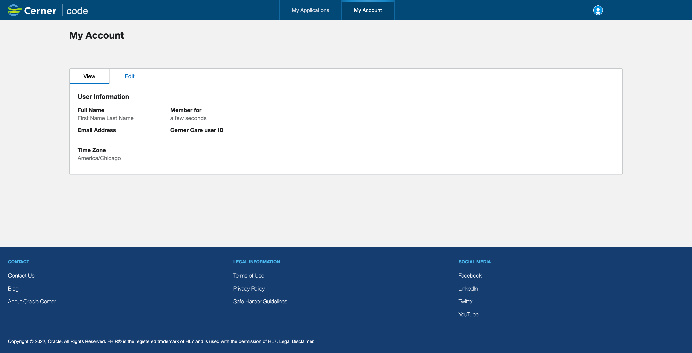
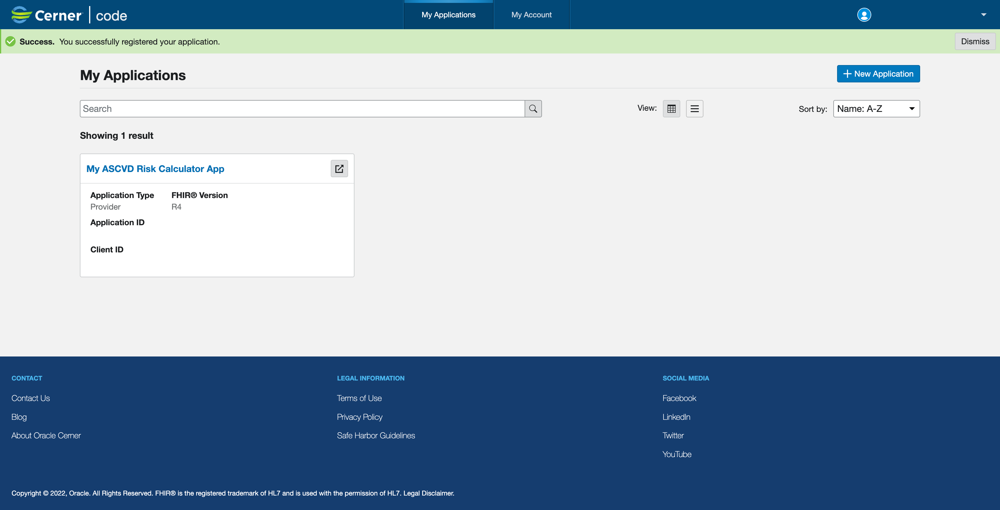
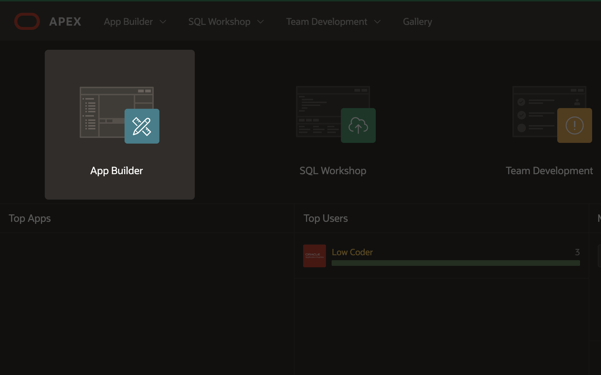
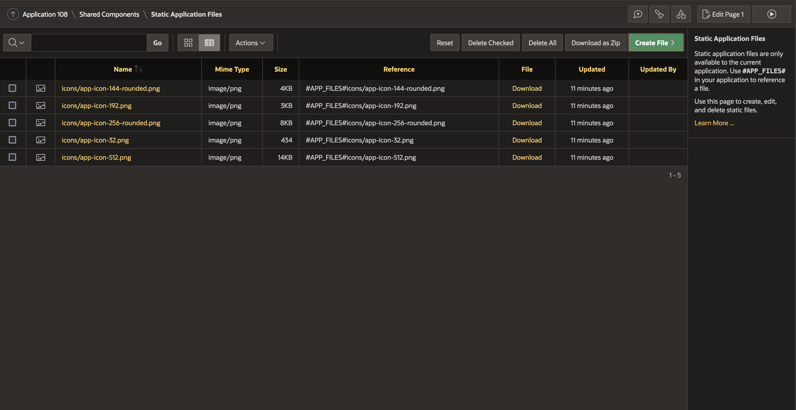
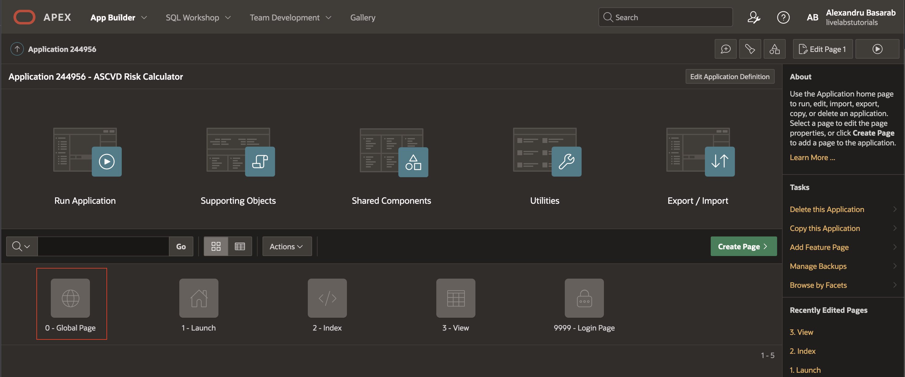
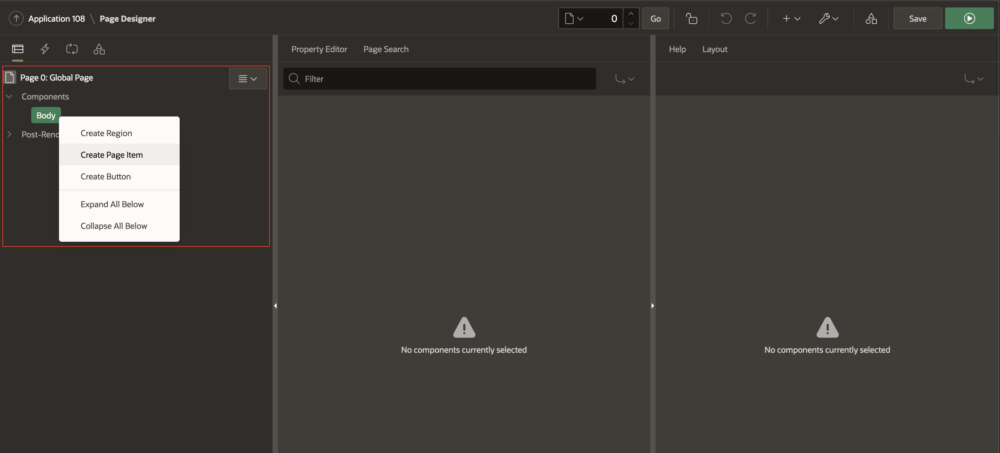
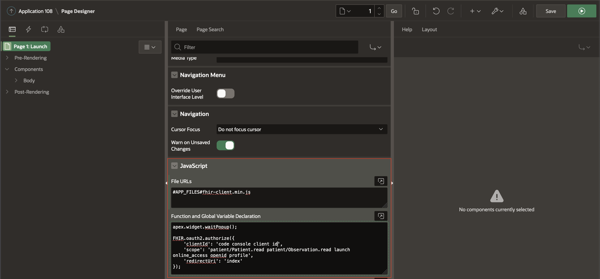
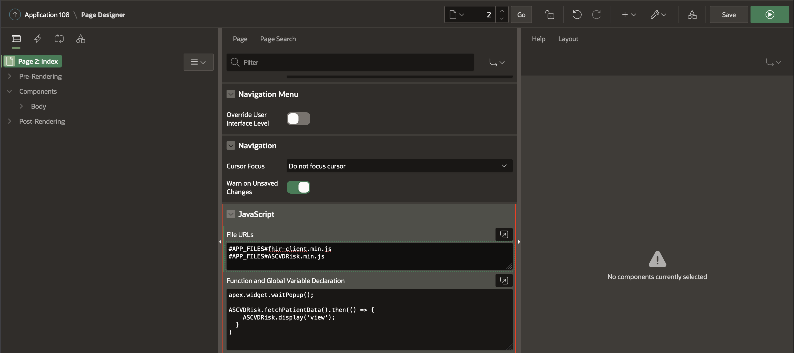

# Sign up for Code Console

## Introduction

This lab walks you through the steps to sign up for Code Console, register a new application and configure the ASCVD Risk Calculator Apex App.

Estimated Time: 5 minutes

### Objectives

In this lab, you will:

- Sign up for Code Console
- Register a new application
- Configure ASCVD Risk Calculator Oracle APEX App

### Prerequisites

This lab assumes you have:

- An Oracle Cloud account
- All previous labs successfully completed

## Task 1: Sign up for Code Console

1. Go to [https://code-console.cerner.com/](https://code-console.cerner.com/). You should see the following page:

   

2. Click on "**Log In**", either from the header or the main page:

   

3. Confirm you are on the following page:

   

4. Click on "**Create an account >>**" button

   

5. Confirm you are on the "**Create account**" page.

   Fill out the form. Make sure to fill out the mandatory fields:

   **Email**: your email with which you will login

   **Password**: a strong password of 6 characters and at least one number or symbol

   **Security questions and answers**: pick an appropriate question that you will know the answer to

   Check that you are not a robot

   Read the **Cerner Terms of Use** and **Cerner Privacy Policy** and check the consent checkbox

   Click "**Create Account**" button.

   

6. To finish registration, check your email and follow the instructions that are necessary to confirm your email and account.

7. **Congratulations**! You now have a **Code Console** account ready to use.

## Task 2: Register a new application

**Note**: If you just registered and followed the steps provided in the confirmation email, after you confirm your email you should be automatically logged in to Code Console. If that's the case you can skip to **Step 3**.

1. Go to [https://code-console.cerner.com/](https://code-console.cerner.com/) and click on "**Log In**", either from the header or the main page:

   

2. Fill out the login form:

   Enter your email address on which you have an account created

   Enter your account's password

   Press the "**Log In**" button.

   

3. Confirm you are on the following page:

   

4. Click on "**My Applications**" tab

   

5. A pop up "**Authorized Representative of the Company**" will appear where you have to do the following:

   Fill out the "**Company Name**"

   Read the terms of use and check the checkbox if you agree

   Click the "**Save**" button.

   

6. Click on "**+ New Application**" button

   

7. Fill out the form as follows:

   **Application Name**: LiveLabs - ASCVD Risk Calculator,

   **Application Type**: You can leave it as **Provider**

   **Type of Access**: You can leave it as **Online**

   **Application Privacy**: You can leave it as **Public**

   **Redirect URI**: If you use [apex.oracle.com](apex.oracle.com), make sure  to update the following link with the required data **[https://apex.oracle.com/pls/apex/r/YOUR-WORKSPACE/YOUR-APP-ALIAS/INDEX-PAGE-ALIAS](https://apex.oracle.com/pls/apex/r/YOUR-WORKSPACE/YOU-APP-ALIAS/INDEX-PAGE-ALIAS)**, it should result in a link like this: **[https://apex.oracle.com/pls/apex/r/livelabstutorials/ascvd-risk/index](https://apex.oracle.com/pls/apex/r/livelabstutorials/ascvd-risk/index)**

   **SMART® Launch URI**: If you use [apex.oracle.com](apex.oracle.com), make sure  to update the following link with the required data **[https://apex.oracle.com/pls/apex/r/YOUR-WORKSPACE/YOUR-APP-ALIAS/LAUNCH-PAGE-ALIAS](https://apex.oracle.com/pls/apex/r/YOUR-WORKSPACE/YOUR-APP-ALIAS/LAUNCH-PAGE-ALIAS)**, it should result in a link like this: **[https://apex.oracle.com/pls/apex/r/livelabstutorials/ascvd-risk/launch](https://apex.oracle.com/pls/apex/r/livelabstutorials/ascvd-risk/launch)**

   **Default FHIR® Version**: R4

   Click **Next**.

   

8. Fill out the form as follows:

   **Select a Product Family**: Millennium

   **Select Products**: Ignite APIs for Millennium: FHIR R4, All

   Click **Next**.

   

9. Check the following **Patient Product APIs**:

   **APIs**: Patient, **Access level**: Read

   **APIs**: Observation; **Access Level**: Read

   Click **Next**.

   

10. Confirm everything is looking as expected. Read the **Terms of Use** and check the checkbox if you agree. Click the **Submit** button.

   

11. **Congratulations**! You now have your first Code Console application created. After its creation you should be able to see it on t he **My Applications** tab.

   

## Task 3: Configure ASCVD Risk Calculator

1. If you have not already logged into your Oracle APEX workspace, sign in using the workspace name, email, and password you signed up with.

   

2. At the top left of your workspace, click App Builder.

   

3. Open ASCVD Risk Calculator

   

4. Open Shared Components

   

5. Select Static Application Files

   

6. Click on Create File

   

7. Click on Drag and Drop

   

8. Import the following dependencies:

   [SMART on FHIR](../0-introduction/files/fhir-client.min.js) official JavaScript library.

   [ASCVD Risk Calculator](../0-introduction/files/fhir-client.min.js) JavaScript library.

   

9. Files should be loaded and you can see the following screen

   

10. Go back to application definition

   

11. Click on **Global Page** to edit it

   

12. Right click on **Body** and press **Create Page Item**

   

13. Create 4 similar items, ISS, CODE, LAUNCH, STATE

   Note: They need to have this exact name, these 4 items will be used by SMART on FHIR JavaScript Library.

   **Identification > Name:** `ISS`

   **Identification > Type:** Hidden

   

14. Edit JavaScript section of **Launch** page and add dependencies

   **JavaScript > File URL's:** #APP_FILES#fhir-client.min.js

   **Javascript > Function and Global Variable Declaration:**

   ```js
   <copy>
   apex.widget.waitPopup();

   FHIR.oauth2.authorize({
      'clientId': 'Code Console Client ID',
      'scope': 'patient/Patient.read patient/Observation.read launch online_access openid profile',
      'redirectUri': 'index'
   });
   </copy>
   ```

   

15. Edit JavaScript section of **Index** page and add dependencies

   **JavaScript > File URL's:**

      #APP_FILES#fhir/fhir-client.min.js

      #APP_FILES#ASCVDRisk#MIN#.js

   **Javascript > Function and Global Variable Declaration:**

   ```js
   <copy>
   apex.widget.waitPopup();

   ASCVDRisk.fetchPatientData().then(() => {
      ASCVDRisk.display('view');
   });
   </copy>
   ```

   

## Acknowledgements

- **Author** - Mircea Iordache, Software Engineer, Open Platform

- **Contributors** - Alexandru Basarab, Senior Software Engineer, Open Platform

- **Last Updated By/Date** - Mircea Iordache, July 2023
