# Create ASCVD Risk Calculator

## Introduction

This lab walks you through the steps to build a fully functional ASCVD (Atherosclerotic Cardiovascular Disease) Risk Calculator.

Estimated Time: 80 minutes

### Objectives

In this lab, you will:

* Configure ASCVD Risk Calculator
* Import Supporting Objects
* Create Application Structure
* Define Page Objects
* Create Validations
* Assign Values
* Represent Data
* (Optional) Esthetics and Finishing Touches

### Prerequisites

This lab assumes you have:

* An Oracle Cloud account
* All previous labs successfully completed

## Task 1: Configure ASCVD Risk Calculator

1. If you have not already logged into your Oracle APEX workspace, sign in using the workspace name, email, and password you signed up with.

   

2. At the top left of your workspace, click **App Builder**.

   

3. Open **ASCVD Risk Calculator**.

   

4. Open **Shared Components**.

   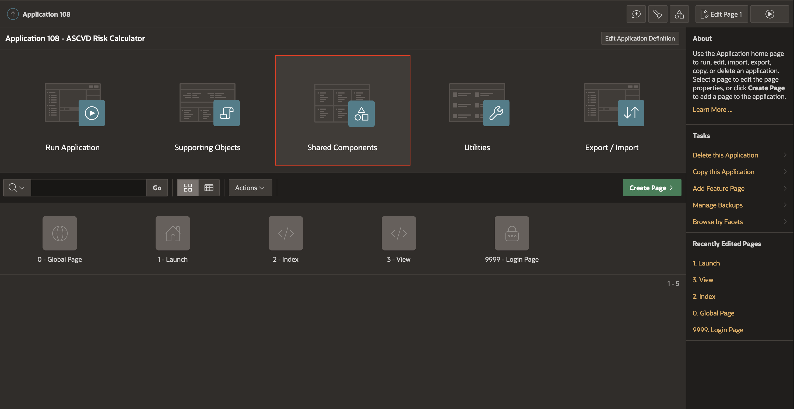

5. Under Files and Reports select **Static Application Files**.

   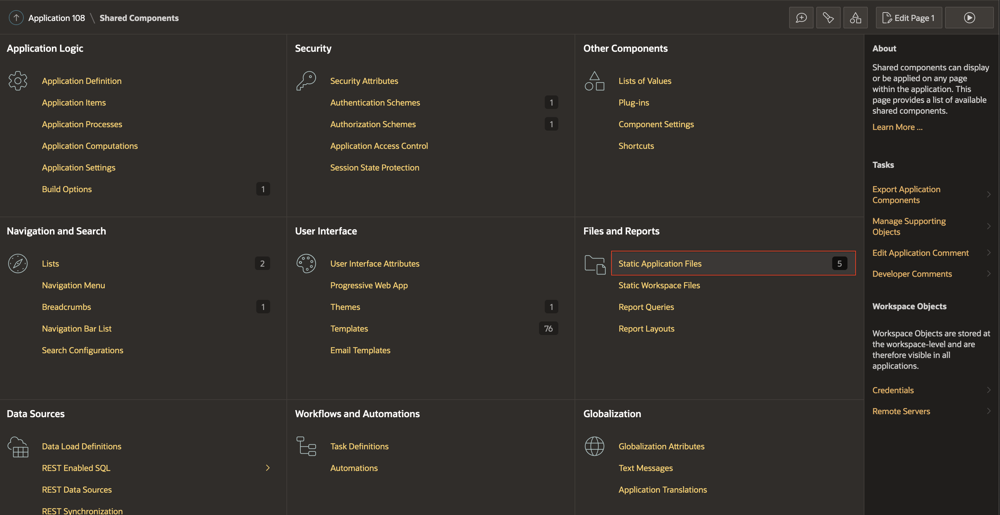

6. Click on **Create File**.

   *Note: From here you will be able to import needed dependencies.*

   

7. Download the following dependencies:

   <a href="../0-introduction/files/fhir-client.min.js" download>SMART on FHIR</a> official JavaScript library.

   <a href="../0-introduction/files/ascvd-risk.min.js" download>ASCVD Risk Calculator</a> JavaScript library.

8. Click on Drag and Drop and select step 7 downloaded dependencies.

   

9. Select the dependencies fhir-client.min.js and ascvd-risk.min.js and then click **Open**. Click **Create** to add them to your application.

   

10. Click **Static Application Files** to see the files.

11. The files will be displayed on the following screen:

   

12. To go back to the application overview, click the application ID in the breadcrumbs in the upper-left.

   

13. Click on **Global Page** to edit it.

   

14. Right-click on Body and then select **Create Page Item**.

   

15. Create four items with the following names: ISS, CODE, LAUNCH, STATE. The names must be uppercase.

    * *Note: These items will be used by SMART on FHIR JavaScript Library. See the following example of how to create item ISS:*

      **Identification > Name:** `ISS`

      **Identification > Type:** Hidden

      *Use the default values for all other fields.*

      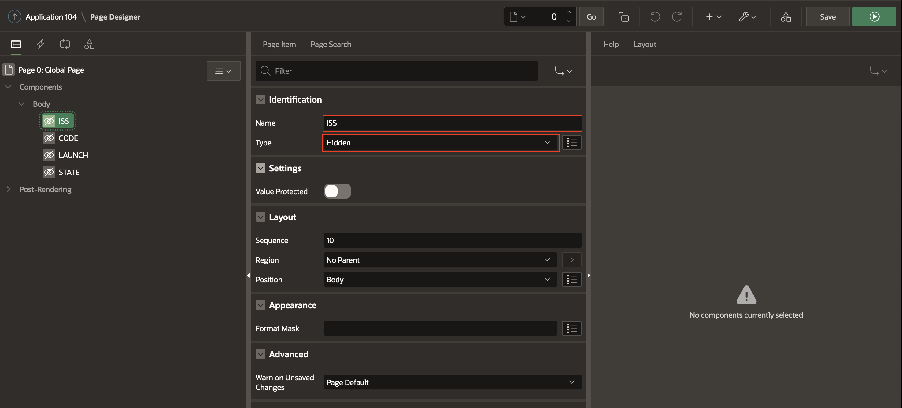

    *Save the page frequently so you do not lose any progress.*

16. Click the application ID in the upper-left and then open the Launch page. Use the information below to add dependencies to the JavaScript section in the middle pane.

       * *Note: Make sure to edit the code-console-client-id in the below Javascript snippet and replace it with Client Id given by Code Console.*

        **JavaScript > File URL's:** #APP_FILES#fhir-client.min.js

        **Javascript > Function and Global Variable Declaration:**

          ```js
          <copy>
          apex.widget.waitPopup();

          FHIR.oauth2.authorize({
             'clientId': 'code-console-client-id',
             'scope': 'patient/Patient.read patient/Observation.read launch online_access openid profile',
             'redirectUri': 'index'
          });
          </copy>
          ```

      

   *Save the page frequently so you do not lose any progress.*

17. Click the application ID in the upper-left and then open the Index page. Use the information below to add dependencies to the JavaScript section in the middle pane.

  **JavaScript > File URL's:**

      #APP_FILES#fhir-client.min.js

      #APP_FILES#ascvd-risk.min.js

  **Javascript > Function and Global Variable Declaration:**

    ```js
    <copy>
    apex.widget.waitPopup();

    ASCVDRisk.fetchPatientData().then(() => {
        ASCVDRisk.display('view');
    });
    </copy>
    ```

  

   *Save the page frequently so you do not lose any progress.*

## Task 2: Import Supporting Objects

1. See [supporting_objects.sql on GitHub](files/supporting_objects.sql) to download the supporting objects SQL file.

2. In the navigation bar, select **SQL Workshop > SQL Scripts**.

   

3. Click **Upload**, select `supporting_objects.sql` in the File field, and then click **Upload**.

    

4. Click the **run** icon to run the uploaded script.

   

5. Confirm by clicking on **Run Now**.

   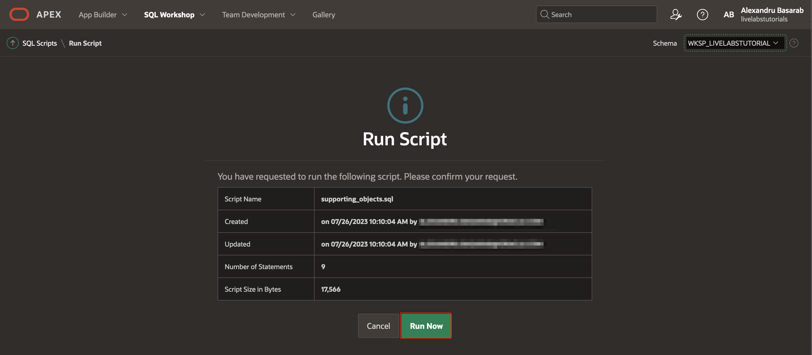

6. Results should show 9 statements processed successfully.

   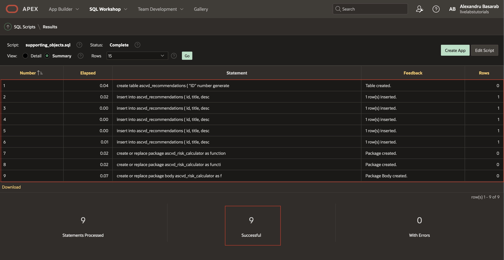

## Task 3: Create Application Structure

1. Click the application ID in the upper-left and then open the View page.

  

2. Create a Patient Information container by right-clicking on Body and then selecting **Create Region**.

  

  Copy the following code and add it to **Source > HTML Code** and name the region **ASCVD Risk Calculator**.

    ```html
    <copy>
    <span class="u-color-9-text">Please be aware the application is an example and should not be used to calculate real risk factors!</span>
    <div id="patient-info"></div>
    </copy>
    ```

  

  Under **Appearance > Template** select **Hero** and **Appearance > Icon** add **fa-user** as icon.

  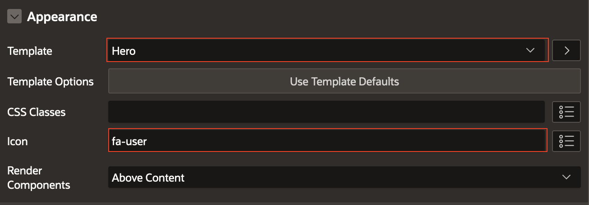

  In the Layout section, update the Position value to Breadcrumb Bar.

  

  *Save the page frequently so you do not lose any progress.*

3. Create a Tabs container by right-clicking on Body and then selecting **Create Region**.

  

  In the Appearance section, update the Template value to Tabs Container.
  

  Click **Use Template Defaults**, Simple in the Template Options field, update the following fields, and then click **OK**:

     - **Common > General:** Select **Remember Active Tab**
     - **Common > Layout:** Fill Tab Labels
     - **Common > Tab Style:** Pill
     - **Common > Tab Size:** Large

  

  In the Advanced section, update the Static ID field to **tabs**.
  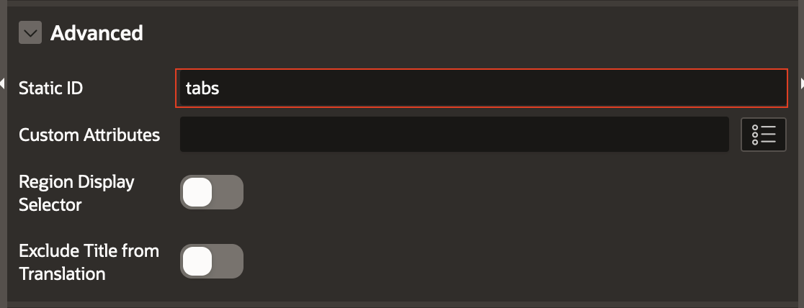

4. Create results by right-clicking on the Tabs container and then selecting **Create Sub Region**.

      * Title the region **Results**.

       

     * Click **Use Template Defaults, Simple** in the Template Options field, update the following fields, and then click **OK**:
         * **Common > Header:** Hidden but accessible

       

5. Create risk factors by right-clicking on the Tabs container and then selecting **Create Sub Region**.

      * Title the region Risk Factors.

       

      * Click **Use Template Defaults, Simple** in the Template Options field, update the following fields, and then click **OK**:

        * **Common > Header:** Hidden but accessible
        * **Common > Style:** Remove UI Decoration

      

      * In the Advanced section, update the Static ID field to **risk-factor**.

      

      * In the Server-Side Condition section, update Type to **Request = Value** and Value to **show**.

      

6. Create recommendations by right-clicking on the Tabs container and then selecting **Create Sub Region**.

  

      * Update the following fields in the Identification section:
        * **Identification > Title:** Recommendations
        * **Identification > Type:** Classic Report

      * Update the following fields in the Source section:
        * **Source > Location:** Local Database
        * **Source > Type:** SQL Query
        * **Source > SQL Query:**

         ```sql
         <copy>
         select item_classes,
               selection,
               icon_class,
               icon_html,
               title,
               description,
               misc,
               actions
         from ASCVD_RECOMMENDATIONS
         </copy>
         ```

         

      * Click **Use Template Defaults, Simple** in the Template Options field and then update Common > Header to **Hidden but accessible**.

       

      * In the Advanced section, update the Static ID field to **recommendations**.

      * In the Server-Side Condition section, update Type to **Request = Value** and Value to **show**.

       

      * In the Attributes tab in the right pane, update the following values:

        * **Appearance > Template:** Content Row
        * **Pagination > Type:** No Pagination (Show All Rows)

    

  *Save the page frequently so you do not lose any progress.*

## Task 4: Define Page Objects

1. To create a Gender item, right-click on the Results container and then select **Create Page Item**.

    

    * Enter or select the following information:
        * **Identification > Name:** `P3_GENDER`
        * **Identification > Type:** Radio Group
        * **Identification > Type:** Radio Group
        * **Label:** Gender
        * **Settings > Number of Columns:** 2
        * **Appearance > Template:** Required - Above
        * **Appearance > Template Option > Required Indicator:** Asterisk
        * **Appearance > Template Option > Item Group Display:** Display as Pill Button

      

    * Update the following fields in the List of Values section:
        * **List of Values > Display Extra Values:** Unchecked
        * **List of Values > Display Null Value:** Unchecked

      

    * (Optional) If you want to duplicate a previously created item, right click the item and select **Duplicate**.
        * Update the item name.

      

2. To create a Total Cholesterol (mg/dL) item, right-click on the Results container and then select **Create Page Item**.

    * Enter or select the following information:
        * **Identification > Name:** `P3_TOTAL_CHOLESTEROL`
        * **Identification > Type:** Number Field
        * **Label:** Total Cholesterol (mg/dL)
        * **Layout > Start New Row:** Unchecked
        * **Appearance > Template:** Required - Above
        * **Appearance > Template Option > Required Indicator:** Asterisk
        * **Appearance > Value Placeholder:** 130 - 320
    * (Optional) If you want to duplicate a previously created item, right click the item and select **Duplicate**.
        * Update the item name.

3. To create a Diabetes item, right-click on the Results container and then select **Create Page Item**.

    * Enter or select the following information:
        * **Identification > Name:** `P3_DIABETES`
        * **Identification > Type:** Radio Group
        * **Label:** Diabetes
        * **Settings > Number of Columns:** 2
        * **Layout > Start New Row:** Unchecked
        * **Appearance > Template:** Required - Above
        * **Appearance > Template Option > Required Indicator:** Asterisk
        * **Appearance > Template Option > Item Group Display:** Display as Pill Button
    * Update the following fields in the List of Values section:
        * **List of Values > Display Extra Values:** Unchecked
        * **List of Values > Display Null Value:** Unchecked

        

    * (Optional) If you want to duplicate a previously created item, right click the item and select **Duplicate**.
        * Update the item name.

4. To create an Age item, right-click on the Results container and then select **Create Page Item**.

      * Enter or select the following information:
          * **Identification > Name:** `P3_AGE`
          * **Identification > Type:** Number Field
          * **Label:** Age
          * **Layout > Start New Row:** Checked
          * **Appearance > Template:** Required - Above
          * **Appearance > Template Option > Required Indicator:** Asterisk

      * (Optional) If you want to duplicate a previously created item, right click the item and select **Duplicate**.
          * Update the item name.

5. To create an HDL – Cholesterol (mg/dL) item, right-click on the Results container and then select **Create Page Item**.

      * Enter or select the following information:
          * **Identification > Name:** `P3_HDL`
          * **Identification > Type:** Number Field
          * **Label:** HDL - Cholesterol (mg/dL)
          * **Layout > Start New Row:** Unchecked
          * **Appearance > Template:** Required - Above
          * **Appearance > Template Option > Required Indicator:** Asterisk
          * **Appearance > Value Placeholder:** 20 - 100
      * (Optional) If you want to duplicate a previously created item, right click the item and select **Duplicate**.
          * Update the item name.

6. To create a Current Smoking item, right-click on the Results container and then select Create Page Item.

      * Enter or select the following information:
          * **Identification > Name:** `P3_SMOKING`
          * **Identification > Type:** Radio Group
          * **Label:** Current Smoking
          * **Settings > Number of Columns:** 2
          * **Layout > Start New Row:** Unchecked
          * **Appearance > Template:** Required - Above
          * **Appearance > Template Option > Required Indicator:** Asterisk
          * **Appearance > Template Option > Item Group Display:** Display as Pill Button
      * Update the following fields in the List of Values section:
          * **List of Values > Display Extra Values:** Unchecked
          * **List of Values > Display Null Value:** Unchecked

        

      * (Optional) If you want to duplicate a previously created item, right click the item and select **Duplicate**.
          * Update the item name.

7. To create a Race item, right-click on the Results container and then select **Create Page Item**.

      * Enter or select the following information:
          * **Identification > Name:** `P3_RACE`
          * **Identification > Type:** Radio Group
          * **Label:** Race
          * **Settings > Number of Columns:** 1
          * **Layout > Start New Row:** Checked
          * **Appearance > Template:** Required - Above
          * **Appearance > Template Option > Required Indicator:** Asterisk
      * Update the following fields in the List of Values section:
          * **List of Values > Display Extra Values:** Unchecked
          * **List of Values > Display Null Value:** Unchecked

        

      * (Optional) If you want to duplicate a previously created item, right click the item and select **Duplicate**.
          * Update the item name.

8. To create a Systolic Blood Pressure item, right-click on the Results container and then select **Create Page Item**.

      * Enter or select the following information:
          * **Identification > Name:** `P3_SYSTOLIC_BP`
          * **Identification > Type:** Number Field
          * **Label:** Systolic Blood Pressure
          * **Layout > Start New Row:** Unchecked
          * **Appearance > Template:** Required - Above
          * **Appearance > Template Option > Required Indicator:** Asterisk
          * **Appearance > Value Placeholder:** 90 - 200
      * (Optional) If you want to duplicate a previously created item, right click the item and select **Duplicate**.
          * Update the item name.

9. To create a Treatment for Hypertension item, right-click on the Results container and then select **Create Page Item**.

      * Enter or select the following information:
          * **Identification > Name:** `P3_HYPERTENSION`
          * **Identification > Type:** Radio Group
          * **Label:** Treatment for Hypertension
          * **Settings > Number of Columns:** 2
          * **Layout > Start New Row:** Unchecked
          * **Appearance > Template:** Required - Above
          * **Appearance > Template Option > Required Indicator:** Asterisk
          * **Appearance > Template Option > Item Group Display:** Display as Pill Button
      * Update the following fields in the List of Values section:
          * **List of Values > Display Extra Values:** Unchecked
          * **List of Values > Display Null Value:** Unchecked

        

      * (Optional) If you want to duplicate a previously created item, right click the item and select **Duplicate**.
          * Update the item name.

  *Save the page frequently so you do not lose any progress.*

10. Under the Results container, right-click on Region Body and then select **Create Button**.

  

11. Change button attributes as follows.

      * Update the following values:
          * **Identification > Button Name:** CALCULATE_RISK
          * **Label:** See Risk Score
          * **Appearance > Template Options > Size:** Large
          * **Appearance > Template Options > Type:** Primary

12. To create a new branch, click the Processing tab, right-click on Processing and then select **Create Branch**.

  

      * Update the following values:
          * **Identification > Name:** Go To Page view
          * **Behavior > Type:** Page or URL (Redirect)
          * **Behavior > Target:** view
          * **Advanced > Request:** show
          * **Server-side Condition > When Button Pressed:** CALCULATE_RISK

    

## Task 5: Create Validations

1. To create an Age validation, click the Processing tab, right-click on **Validating** and then select **Create Validation**.

  

      * Enter or select the following information:
          * **Identification > Name:** `P3_AGE` range PlSQL
          * **Validation > Type:** Function Body (returning Boolean)
          * **PL/SQL Function Body:**
             ```PlSql
             <copy>
             begin
               if :P3_AGE between 20 and 79 then
                 return true;
               end if;
               return false;
             end;
             </copy>
             ```
          * **Error > Error Message:** #LABEL# must be within 20-79
          * **Error > Associated Item:** `P3_AGE`
          * **Server-side Condition > When Button Pressed:** CALCULATE_RISK

            

2. To create a Total Cholesterol (mg/dL) validation, right-click on P3_AGE range PlSQL and select **Duplicate**.

      * Update the following values:
          * **Identification > Name:** `P3_TOTAL_CHOLESTEROL` range PlSQL
          * **PL/SQL Function Body:**

              ```PlSql
              <copy>
              begin
                if :P3_TOTAL_CHOLESTEROL between 130 and 320 then
                  return true;
                end if;
                return false;
              end;
              </copy>
              ```

           * **Error > Error Message:** Total Cholesterol must be within 130-320 mg/dL
           * **Error > Associated Item:** `P3_TOTAL_CHOLESTEROL`

3. To create an HDL – Cholesterol (mg/dL) validation, right-click on P3_Age range PlSQL and select **Duplicate**.

      * Update the following values:
          * **Identification > Name:** `P3_HDL` range PlSQL
          * **PL/SQL Function Body:**

              ```PlSql
              <copy>
              begin
                if :P3_HDL between 20 and 100 then
                  return true;
                end if;
                return false;
              end;
              </copy>
              ```

           * **Error > Error Message:** HDL must be within 20-100 mg/dL
           * **Error > Associated Item:** `P3_HDL`

4. To create a Systolic Blood Pressure validation, right-click on P3_Age range PlSQL and select **Duplicate**.

      * Update the following values:
          * **Identification > Name:** `P3_SYSTOLIC_BP` range PlSQL
          * **PL/SQL Function Body:**

              ```PlSql
              <copy>
              begin
                if :P3_SYSTOLIC_BP between 90 and 200 then
                  return true;
                end if;
                return false;
              end;
              </copy>
              ```

           * **Error > Error Message:** SBP must be within 90-200 mmHg
           * **Error > Associated Item:** `P3_SYSTOLIC_BP`

5. Create an Item is not null validation for the following items:

     * P3_DIABETES
     * P3_SMOKING
     * P3_HYPERTENSION
     * P3_RACE
     * P3_GENDER

    

* Note: Update the Validation > Item and Error > Associated Item values to the corresponding item for all of the above.

## Task 6: Assign Values

1. In the Dynamic Actions tab, right-click on Page Load and then select **Create Dynamic Action**.

    

    * Name the Dynamic Action: **Show Patient Info**

2. Change the Show action under True to Execute JavaScript Code.

      

      * Update the following values:
          * **Identification > Name:** Set Patient Info
          * **Identification > Action:** Execute JavaScript Code
          * **Settings > Code**
                ```js
                <copy>
                  let patientInfo = JSON.parse(sessionStorage.getItem("ASCVDRisk.patientInfo"));

                  if (patientInfo !== null) {
                    $("#patient-info").append(patientInfo.firstName + ' ' + patientInfo.lastName + ' </br> ' +
                      patientInfo.age + ' yrs ' + patientInfo.gender + ' DOB: ' + patientInfo.birthDateDisplay);
                  }
                </copy>
                ```
          * **Execution > Fire on Initialization:** Checked

3. Click True and add a new action.

   

     * Update the following values:
         * **Identification > Name:** Retrieve Patient Data
         * **Identification > Action:** Execute JavaScript Code
         * **Settings > Code:**

            ```js
              <copy>
                (function() {
                    let patientInfo = JSON.parse(sessionStorage.getItem("ASCVDRisk.patientInfo"));
                    if (patientInfo !== null) {
                        apex.item("P3_AGE").setValue(patientInfo.age);
                        apex.item("P3_GENDER").setValue(patientInfo.gender);
                        apex.item("P3_TOTAL_CHOLESTEROL").setValue(patientInfo.totalCholesterol);
                        apex.item("P3_HDL").setValue(patientInfo.hdl);
                        apex.item("P3_SYSTOLIC_BP").setValue(patientInfo.systolicBloodPressure);
                        apex.item("P3_RACE").setValue(patientInfo.relatedFactors.race);
                        apex.item("P3_DIABETES").setValue(patientInfo.relatedFactors.diabetic);
                        apex.item("P3_SMOKING").setValue(patientInfo.relatedFactors.smoker);
                        apex.item("P3_HYPERTENSION").setValue(patientInfo.relatedFactors.hypertensive);
                    }
                })()
              </copy>
            ```

          * **Affected Elements > Selection Type:** Item(s)
          * **Affected Elements > Item(s):**
              `P3_AGE,P3_GENDER,P3_TOTAL_CHOLESTEROL,P3_HDL,P3_SYSTOLIC_BP,P3_DIABETES,P3_SMOKING,P3_HYPERTENSION`

      *Note: If you followed the workshop exactly and named all the objects as above then you can copy/paste them, if not change with the according object names.*

## Task 7: Represent Data

*Note: Save the page frequently so you do not lose any progress.*

1. Right-click on the Risk Factors container and select **Create Sub Region**.

   

      * Update the following values:
        * **Identification > Name:** Chance of heart attack or stroke
        * **Identification > Type:** Chart

2. To create a Current Risk series, right-click on Series and select **New**.

      * Update the following values:
          * **Identification > Name:** Current Risk
          * **Source > Type:** SQL Query
          * **Source > SQL Query:**

              ```sql
              <copy>
                select ASCVD_RISK_CALCULATOR.computeTenYearScore(:P3_AGE,
                                                                :P3_TOTAL_CHOLESTEROL,
                                                                :P3_HDL,
                                                                :P3_SYSTOLIC_BP,
                                                                :P3_HYPERTENSION,
                                                                :P3_SMOKING,
                                                                :P3_DIABETES,
                                                                :P3_RACE,
                                                                :P3_GENDER) / 100 as chart_value,
                      '10 Year Risk' as chart_label
                from dual where :P3_AGE > 39
                union
                select ASCVD_RISK_CALCULATOR.computeLifetimeRisk(:P3_AGE,
                                                                :P3_TOTAL_CHOLESTEROL,
                                                                :P3_HDL,
                                                                :P3_SYSTOLIC_BP,
                                                                :P3_HYPERTENSION,
                                                                :P3_SMOKING,
                                                                :P3_DIABETES,
                                                                :P3_RACE,
                                                                :P3_GENDER) / 100 as chart_value,
                      'Lifetime Risk' as chart_label
                from dual where :P3_AGE < 60
              </copy>
              ```

          * **Column Mapping > Label:** `CHART_LABEL`
          * **Column Mapping > Value:** `CHART_VALUE`
          * **Label > Show:** Checked
          * **Label > Position:** Outside Slice

3. To create a Lowest Possible Risk series, right-click on Series and select **New**.

   

    * Update the following values:
        * **Identification > Name:** Lowest Possible Risk
        * **Source > Type:** SQL Query
        * **Source > SQL Query:**

            ```sql
            <copy>
            select ASCVD_RISK_CALCULATOR.computeLowestTenYear(:P3_AGE, :P3_RACE, :P3_GENDER) / 100 as chart_value,
                  '10 Year Risk' as chart_label
            from dual where :P3_AGE > 39
            union
            select ASCVD_RISK_CALCULATOR.computeLowestLifetime(:P3_AGE, :P3_RACE, :P3_GENDER) / 100 as chart_value,
                  'Lifetime Risk' as chart_label
            from dual where :P3_AGE < 60
            </copy>
            ```

        * **Column Mapping > Label:** `CHART_LABEL`
        * **Column Mapping > Value:** `CHART_VALUE`
        * **Label > Show:** Checked
        * **Label > Position:** Outside Slice

4. Under Axes, select y and update the following values:

     * **Identification > Title:** Percent (%)
     * **Value > Minimum:** 0
     * **Value > Maximum:** 1
     * **Value > Format:** Percent
     * **Value > Decimal Places:** 2
     * **Value > Format Scaling:** Automatic

   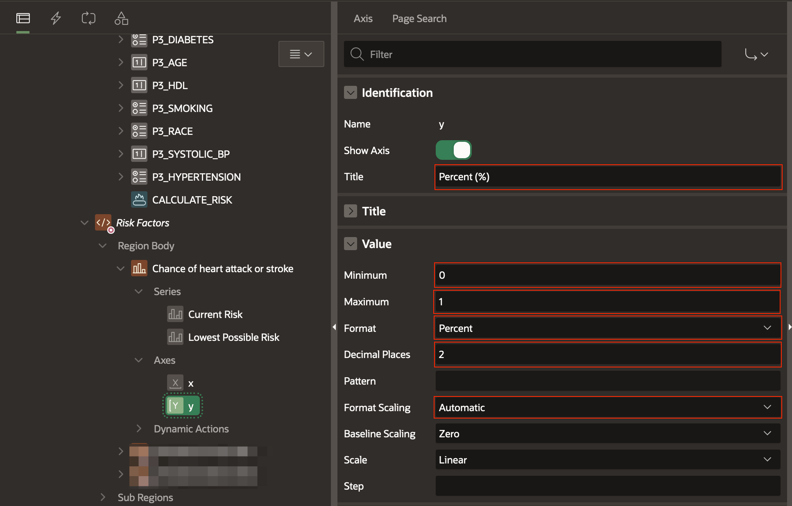

5. To enable the chart legend, click the chart region **Chance of Heart Attack or Stroke** and then click the Show switch to the on position in the Legend section.

  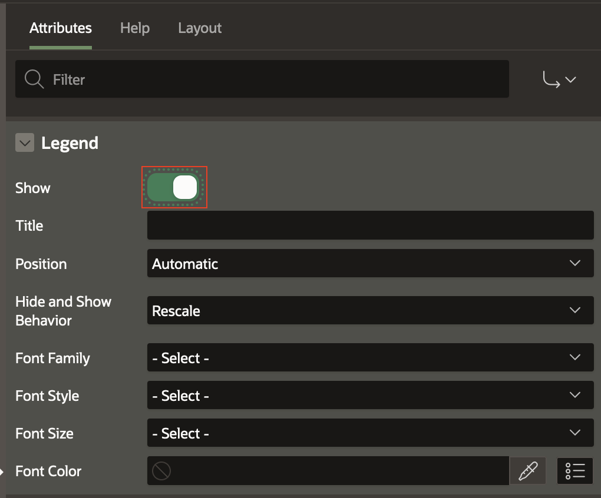

  *Save the page frequently so you do not lose any progress.*

## Task 8 (Optional): Esthetics and Finishing Touches

1. Click the **Rendering** tab and open the page attributes.

  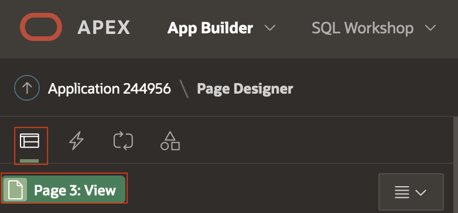

2. Update the following values:

     * **Appearance > Page Template:** Minimal (No Navigation)
     * **CSS > Inline:**

        ```css
        <copy>
        .apex-button-group label, .t-Form-fieldContainer--radioButtonGroup .apex-item-group--rc label {
        padding-block-end: calc(var(--a-field-input-padding-y, .25rem) - var(--a-field-input-border-width, 1px));
        padding-block-start: var(--ut-field-fl-label-offset,calc(var(--a-field-input-padding-y, .25rem) - var(--a-field-input-border-width, 1px)));
        padding-inline-end: calc(var(--a-field-input-padding-x, .25rem) - var(--a-field-input-border-width, 1px));
        padding-inline-start: var(--ut-field-input-padding-x-offset,calc(var(--a-field-input-padding-x, .25rem) - var(--a-field-input-border-width, 1px)));
        }
        </copy>
        ```

3. Click the **Dynamic Action** tab, right-click on Events and then create a dynamic action with the following values:

      * **Identification > Name:** Show Risk Factors
      * **When > Event:** After Refresh
      * **When > Selection Type:** Region
      * **When > Region:** Chance of heart attack or stroke
      * **Server-side Condition > Type:** Request = Value
      * **Server-side Condition > Value:** show

    

4. Under the Show Risk Factors section for the dynamic action, right-click on **True** and then select **Create TRUE Action**.

    *Note: A true action will be created automatically when you create the Dynamic Action, you can change that one.*

    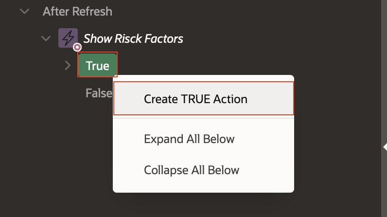

5. Update the following values:

     * **Identification > Action:** Execute JavaScript Code
     * **Settings > Code:**

        ```js
        <copy>
          apex.region("tabs").widget().aTabs("getTabs")["#SR_risk-factor"].makeActive();
        </copy>
        ```

     * **Affected Elements > Section Type:** Region
     * **Affected Elements > Region:** ..Results

      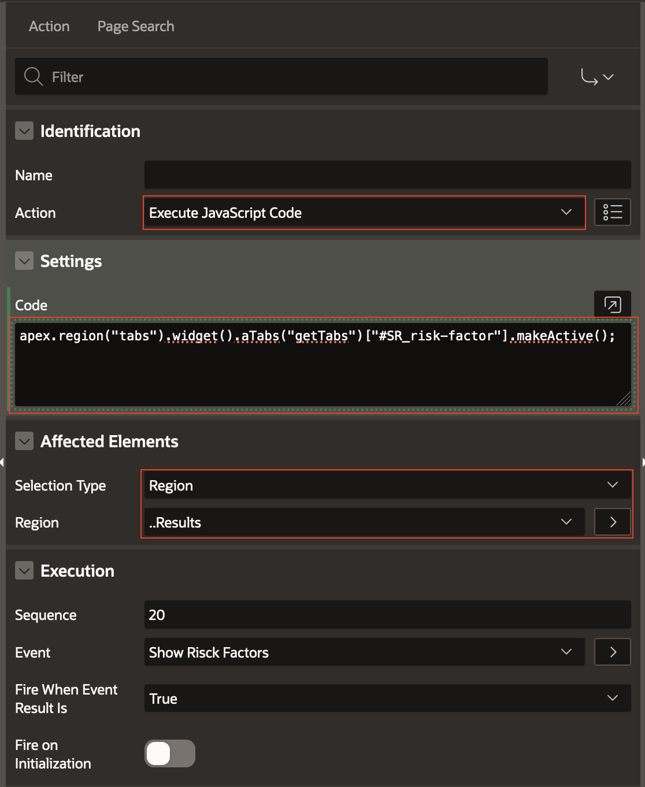

## Acknowledgements

* **Author** - Alexandru Basarab, Software Development Manager, OHAI - Platform Initiatives

* **Contributors**
  * Mircea Iordache, Software Engineer, OHAI - Platform Initiatives
  * Tudor Dragomir, Software Engineer, OHAI - Platform Initiatives
  * Ionut Balan, Software Engineer, OHAI - Platform Initiatives
  * Cornel Porosnicu, Software Engineer, OHAI - Platform Initiatives

* **Last Updated By/Date** - Basarab Alexandru, August 2023
