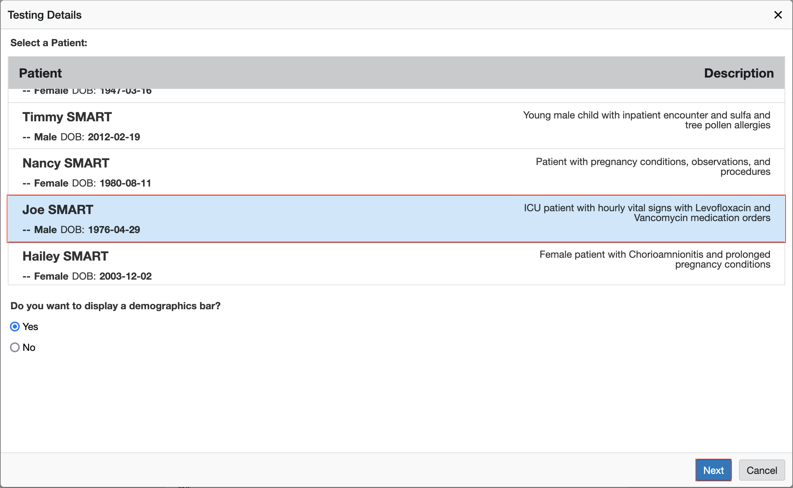

# Run ASCVD Risk Calculator

## Introduction

This lab walks you through the steps to run ASCVD (Atherosclerotic Cardiovascular Disease) Risk Calculator.

Estimated Lab Time: 5 minutes

### Objectives

In this lab, you will:

* Run in Standalone
* Run via Code Console
* (Optional) Update the Theme

### Prerequisites

This lab assumes you have:

* An Oracle Cloud account
* All previous labs successfully completed

## Option 1: Standalone

1. Click on **App Builder** and open your application.

    

2. Open the application by clicking on the card.

    

3. Run the application.

    

## Option 2: Code Console

1. Log-in to Code Console.

    

2. Go to My Applications in Code Console.

    

3. Click on the application name in Code Console.

    

4. Click on **Test Sandbox**.

    

5. Select a Patient and click **Next**.

    

6. Remember username and password and click on **Launch**.

    **Username:** portal

    **Password:** portal

    

## (Optional) Update the Theme

1. In the tab that your app is running in, there will be a grey toolbar at the bottom of the page. This is your development toolbar that allows you to edit regions in your application user interface (UI) directly in the tab it's running in.  
*Note: If you do not see the grey developer toolbar, mouse over the bottom of your browser window to make it display. End users who log directly into the app will not see this toolbar.*

2. In the dev toolbar, click on **Customize** and then click **Theme Roller**.

    

3. Within the Theme Roller, you can modify many different aspects of the application UI. You will use it right now to update the Theme.

4. Under the **Theme** section, click on the Select Theme select box and choose **Redwood Light**.

5. Under **Redwood Options** section, Layout select **Contained** then press **Save As** and provide your desired **Style Name**.

    

## Acknowledgements

* **Author** - Alexandru Basarab, Software Development Manager, OHAI - Platform Initiatives

* **Contributors**
    * Mircea Iordache, Software Engineer, OHAI - Platform Initiatives
    * Tudor Dragomir, Software Engineer, OHAI - Platform Initiatives
    * Ionut Balan, Software Engineer, OHAI - Platform Initiatives
    * Cornel Porosnicu, Software Engineer, OHAI - Platform Initiatives

* **Last Updated By/Date** - Basarab Alexandru, August 2023
